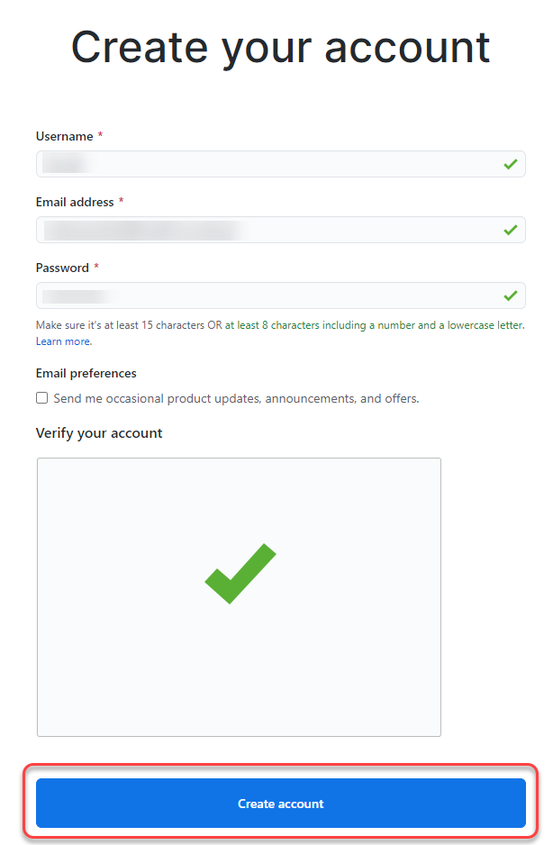

# Introduction to Git

GitHub is a web hosting service. It is designed for software projects that use the Git version control system. 

In this section you will learn:
* how to create a GitHub account
* how to create a private GitHub repository
* how to share a private repository with selected users

# Creating an account

To create an account on GitHub, perform the following actions:

1. Go to [github.com](https://github.com).
2. Select ***Sign up for GitHub***.    
   
     
   
3. Then enter the necessary information and click ***Create account***.     

   

# GitHub Desktop 

1. Install [GitHub Desktop Client](https://desktop.github.com/) on your computer.  
   
2. If you want to connect GitHub Desktop with GitHub, you'll need to authenticate your account. If you need more information, go to [docs.github.com](https://docs.github.com/en/desktop/installing-and-configuring-github-desktop/authenticating-to-github).

# Private repository

## How to create a private repository?

You have two ways to create a private repository. You can do this through GitHub or GitHub Desktop.  

To create a private repository on GitHub, perform the following actions:

1. Log in to your account.
2. Then click ***New*** at the top left of the screen.
3. In the specified space, type the name of the repository.
4. Select ***Private***.
5. Then click ***Create repository***.  
   
To create a private repository on GitHub Desktop, perform the following actions:  

1. In the top menu click ***File***.
2. Then select ***New repository...***.
3. In the specified space, type the name of the repository.
4. Select a local path.
5. Then click ***Create repository***. Now, the repository is available on your local machine. 
6. If you want to publish a repository on GitHub, select ***Publish repository*** on the main GitHub Desktop screen.
7. Select ***Keep this code private***.
8. Then click ***Publish repository***.

## Managing access to private repository

If you want to invite collaborators to your private repository, perform the following actions:  

1. Log in to your GitHub account. 
2. On the right side of the screen you will see a list of all your repositories. Select the one you want to share.
3. On your repository page, select ***Settings***.
4. Then select ***Manage access*** from the list on the left side of the screen.  
   
   **📝 Note:** At this point you may be asked to re-enter your account password.

5. Click ***Invite a collaborator***.
6. Type the user’s name account you want to invite.
7. Click ***Select a collaborator above***.

