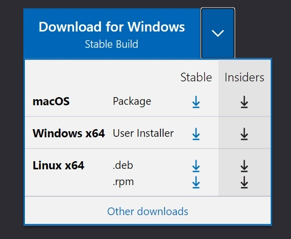
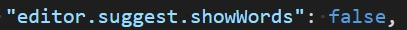

## 1. Visual Studio Code

### 1.1. How to install VS Code?

1. To install VS Code, go to [code.visualstudio.com](https://code.visualstudio.com/).
2. Select from the list the operating system you are using.  
   

3. Then click *Download*.

### 1.2. How to install extensions to VS Code?

1. Click *View*.
2. Then click *Extensions*.
3. Find and select from the list the extension you are interested in.

Recommended extension: *Markdown All In One* - it will allow you to generate a table of contents and make it easier to format your document.

### 1.3. Useful VS Code options 

#### 1.3.1. Commands

If you want to find the command you need, click **Shift+Ctrl+p**.

#### 1.3.2. Preview

If you want to generate a preview of your document, click *Open Preview to the Side* in the upper right corner.

#### 1.3.3. Displaying whitespace

If you want to see whitespace between words, click *View*. Then click *Render Whitespace*.

#### 1.3.4. Suggestions

If you want the program to suggest you a word or formatting element, click **Ctrl+Space**.

#### 1.3.5. Formatting suggestions

If you want to configure the program to suggest you formatting elements rather than words, follow the instructions below:

1. Click **Shift+Ctrl+p**.
2. Find and select *Preferences: Configure Language Specific Settings*.
3. Then select *Markdown*.
4. When the *settings.json* file opens, type  `false` instead of `true` after the: `"editor.suggest.showWords":`

